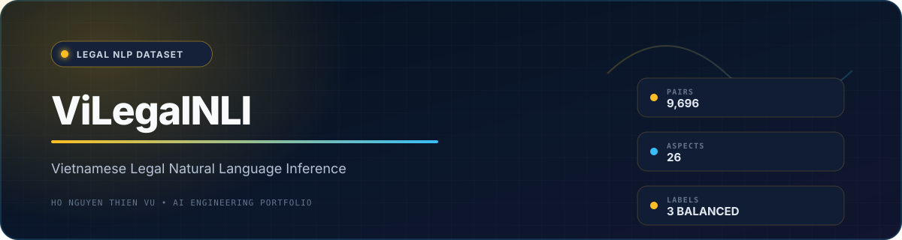

<div align="center">
  
  <br /><br />

  
  
  
  
</div>

## Overview

**ViLegalNLI** is a Vietnamese legal-domain Natural Language Inference dataset for research on entailment, neutrality, and contradiction in low-resource, domain-specific language understanding.

The dataset was developed as a Natural Language Processing for Data Science course project at the **University of Information Technology - VNU-HCM**.

<div align="center">
  <a href="dataset/ViLegalNLI.xlsx">
    
  </a>
</div>

## Dataset Card

| Premise-hypothesis pairs | Source documents | Legal aspects | Labels | Source websites |
|---:|---:|---:|---:|---:|
| **9,696** | **3,232** | **26** | **3** | **3** |

| Property | Value |
|---|---|
| Language | Vietnamese |
| Domain | Legal |
| Task | Natural Language Inference |
| Labels | Entailment, Neutral, Contradiction |
| Distribution | 3,232 examples per label |
| File format | XLSX |
| Official split | Not provided |

## Label Distribution

| Label ID | Relation | Examples | Share |
|---:|---|---:|---:|
| `0` | Entailment | 3,232 | 33.3% |
| `1` | Neutral | 3,232 | 33.3% |
| `2` | Contradiction | 3,232 | 33.3% |

## Dataset Schema

| Column | Description |
|---|---|
| `Hypothesis` | Statement whose relation to the premise is classified |
| `Premise` | Relevant legal passage used for NLI |
| `Text` | Longer source-document context |
| `Aspect` | Legal-domain category |
| `Website` | Source website |
| `Label` | Integer NLI label |
| `List Evidence` | Evidence supporting the assigned relation, when available |
| `Explanation` | Natural-language explanation of the label |
| `File Path` | Historical collection path; not a portable identifier |
| `Text Length` | Recorded source-text length |

## Source Distribution

| Source | Examples | Share |
|---|---:|---:|
| `thuvienphapluat.vn` | 5,802 | 59.8% |
| `vanban.chinhphu.vn` | 2,400 | 24.8% |
| `dulieuphapluat.vn` | 1,494 | 15.4% |

The 26 legal aspects include public administration, public finance, investment, transportation, education, civil law, construction, urban development, and other legal topics.

## Load the Dataset

```bash
pip install pandas openpyxl
```

```python
import pandas as pd

df = pd.read_excel("dataset/ViLegalNLI.xlsx")

print(df.shape)  # (9696, 10)
print(df["Label"].value_counts().sort_index())
```

## Data Quality Notes

A direct audit of the published workbook found:

| Check | Result |
|---|---:|
| Missing `Hypothesis` | 13 rows |
| Missing `Premise` | 24 rows |
| Duplicated premise-hypothesis pairs | 13 rows |
| Fully duplicated rows | 0 |
| Label balance | Balanced |

Users should explicitly document how missing and duplicated pairs are handled. When creating train, development, and test splits, group related examples by source document to reduce leakage.

## Intended Use

- Academic research in Vietnamese legal NLP
- Natural Language Inference experiments
- Domain adaptation and model evaluation
- Data-quality and low-resource language research

## Limitations

- ViLegalNLI is not legal advice and must not be used as the sole basis for legal decisions.
- The workbook does not provide an official train/development/test split.
- Legal language and source websites change over time.
- Automatically generated hypotheses or explanations may contain errors.
- Source text may be copyrighted; review provenance and terms before redistribution or commercial use.

## Repository Structure

```text
ViLegalNLI-dataset/
├── dataset/
│   └── ViLegalNLI.xlsx
├── Source/
│   ├── BuildingViLegalNLI.ipynb
│   └── TrainingModel.ipynb
├── Report/
└── README.md
```

## Team

- Nguyen Phi Long
- Ho Nguyen Thien Vu
- Duong Thi Hong Nhung

**Instructor:** M.A. Huynh Van Tin  
**Project completion:** 2024

## References

This project was informed by SNLI, XNLI, ViNLI, ViHealthNLI, ViFactCheck, PhoBERT, XLM-R, CafeBERT, and mBERT.

- [PhoBERT paper](https://arxiv.org/abs/2003.00744)
- [XLM-R paper](https://arxiv.org/abs/1911.02116)

## License and Citation

No explicit dataset license has been published. Do not assume permission for unrestricted redistribution or commercial use. For research-use and citation questions, contact the repository maintainer through GitHub.
